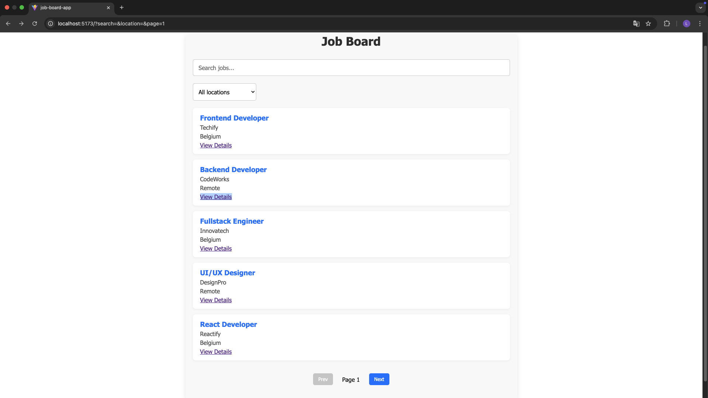
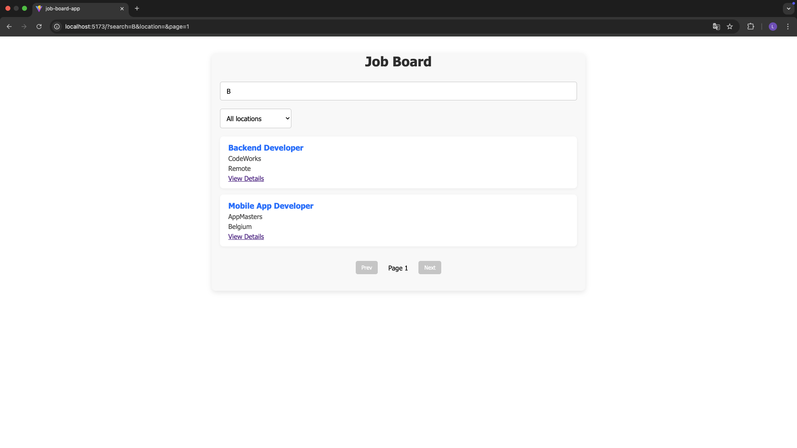
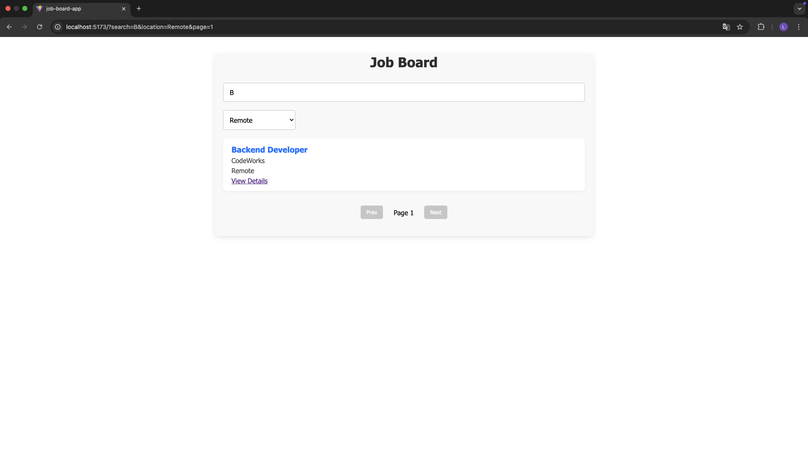
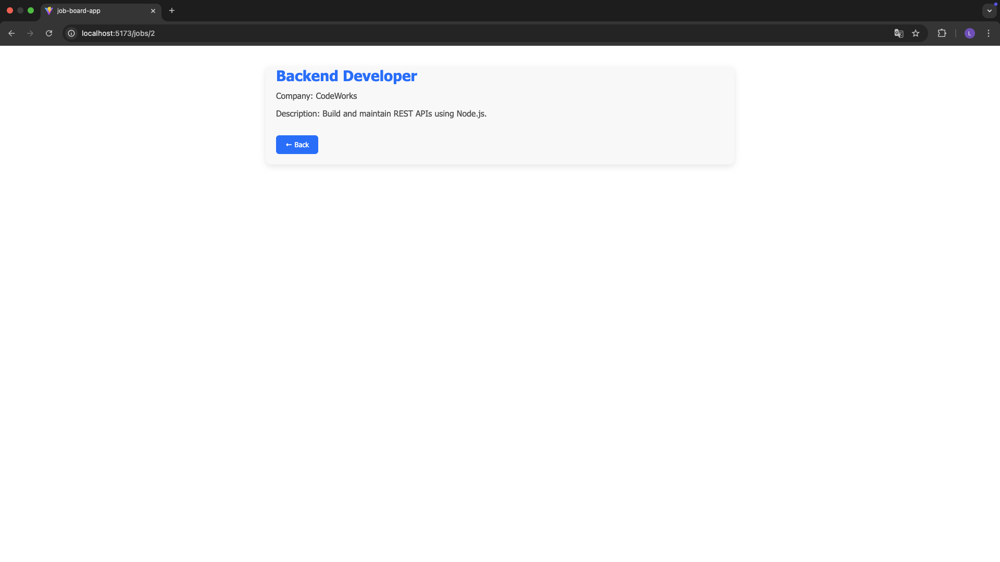
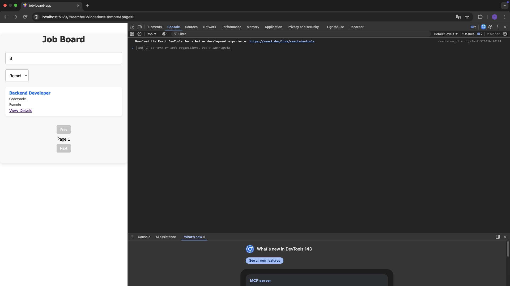
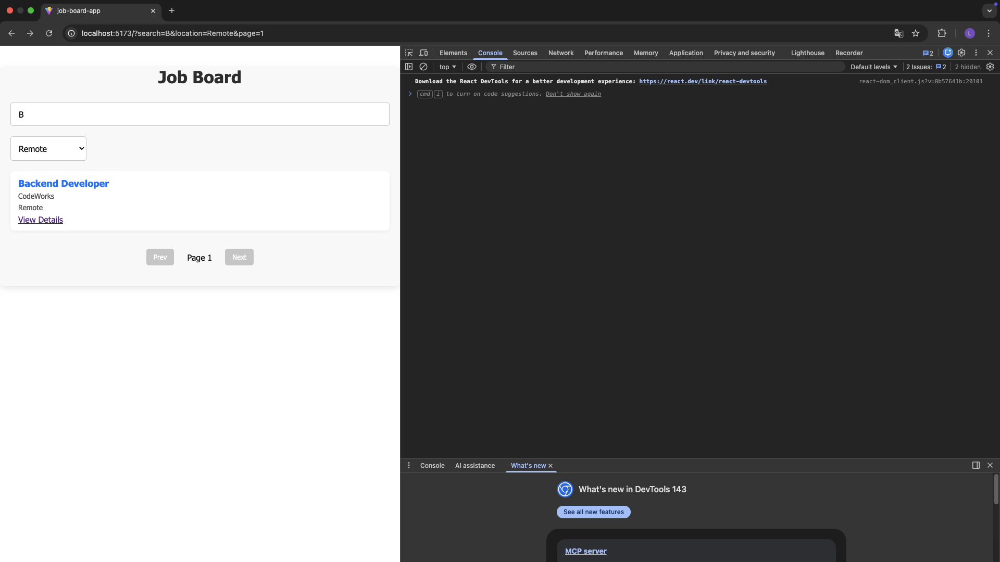

# Job Board App
A modern React Job Board application built to demonstrate real-world frontend skills such as routing, pagination, debounced search, URL-synced state, and responsive design.

This project is designed as a portfolio-ready application, following best practices used in production React apps.

---

## 🚀 Live Demo

https://job-board-app-ivory.vercel.app

---

## 🧠 Features Overview 

### ✅ Core Features

 - Job listing fetched from a mock REST API
 - Job details page with dynamic routing
 - Client-side pagination
 - Search jobs by title or company
 - Filter jobs by location

### 🔥 Advanced Features

- Debounced search input (improves performance & UX)
- URL-synced state using query parameters
    - Pagination, search, and filters persist in the URL
    - Browser Back / Forward navigation fully supported
- Graceful loading and error states
- Edge-case handling for pagination after filtering
- Lazy loading for non-critical routes (Job Details page) to reduce initial bundle size
- Custom loading component used as Suspense fallback for lazy-loaded routes

### 🎨 UI & UX

- Clean and modern UI
- Fully responsive design (mobile, tablet, desktop)
- Consistent layout between pages
- Smooth navigation experience

--- 

## 🧩 Tech Stack

- React (Hooks)
- React Router
- JSON Server (mock API)
- CSS (responsive layout)
- Vite (development & build tool)

---


## 🔍 Implemented Functionalities (Detailed)

1️⃣ Job Listing

- Fetches job data from a REST API
- Displays jobs as reusable cards
- Handles loading and error states

2️⃣ Job Details Page

- Dynamic route: /jobs/:id
- Fetches job details by ID
- Supports browser Back / Forward navigation

3️⃣ Pagination

- Client-side pagination
- Displays 5 jobs per page
- Prev / Next navigation buttons
- Automatically adjusts when filters reduce total pages

4️⃣ Search (Debounced)

- Search by job title or company name
- Debounced input (500ms delay)
- Prevents unnecessary state updates

5️⃣ Filter by Location

- Dropdown filter for job location
- Resets pagination on filter change


6️⃣ URL-Synced State (Advanced)

- Search, filter, and pagination stored in URL query params
- Example URL:
        ```bash
        /?search=react&location=Remote&page=2
        ``` 

- Fully supports:
    - Browser Back / Forward
    - Page refresh
    - Shareable links

7️⃣ Edge Case Handling

- Prevents invalid pagination states
- Displays friendly message when no jobs are found

---

## 📸 Screenshots

### 🏠 Job List Page



### 🔍 Search & Filter




### 📄 Job Details Page



### 📱 Mobile View


### 📱 Tablet View


---

## ⚙️ Getting Started

Follow the steps below to run the project locally:

```bash
# Clone the repository
git clone https://github.com/TheDutchman68/job-board-app

# Navigate to the project folder
cd job-board-app

# Install dependencies
npm install

# Start mock API (JSON Server)
npx json-server --watch db.json --port 5001

# Start development server
npm run dev

# The app will be available at:
http://localhost:5173
```

---

## 📌 What I Learned

- Managing state through URL query parameters
- Implementing debounced inputs in React
- Handling pagination edge cases
- Building responsive layouts without UI libraries
- Structuring a scalable React project
- Improving UX with browser-native navigation support
- Implementing route-based lazy loading to optimize bundle size and performance
- Using Suspense with custom fallback components for better user experience

---

## 📈 Future Improvements

- Authentication (login / protected routes)
- Server-side pagination
- Saved jobs / favorites
- Skeleton loaders
- Real backend integration

---

## 👤 Author

Natanael Dobie
Frontend Developer (React)
    - GitHub: https://github.com/TheDutchman68.
    - LinkedIn: www.linkedin.com/in/natanael-dobie-776059249.


## 📄 License

This project is licensed under the MIT License.