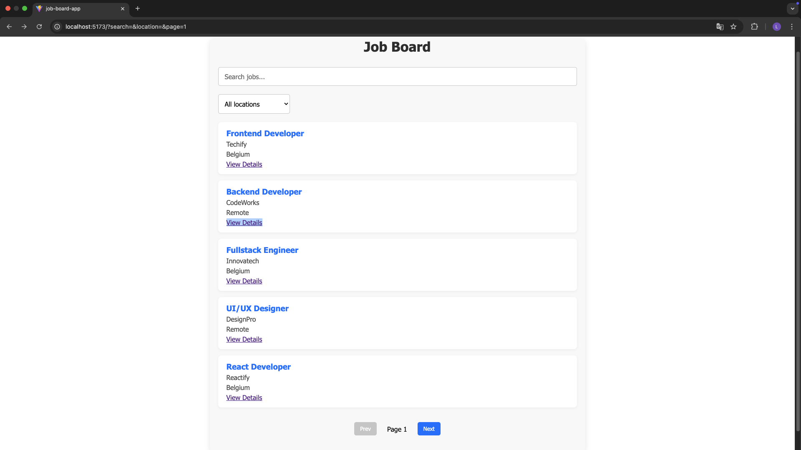
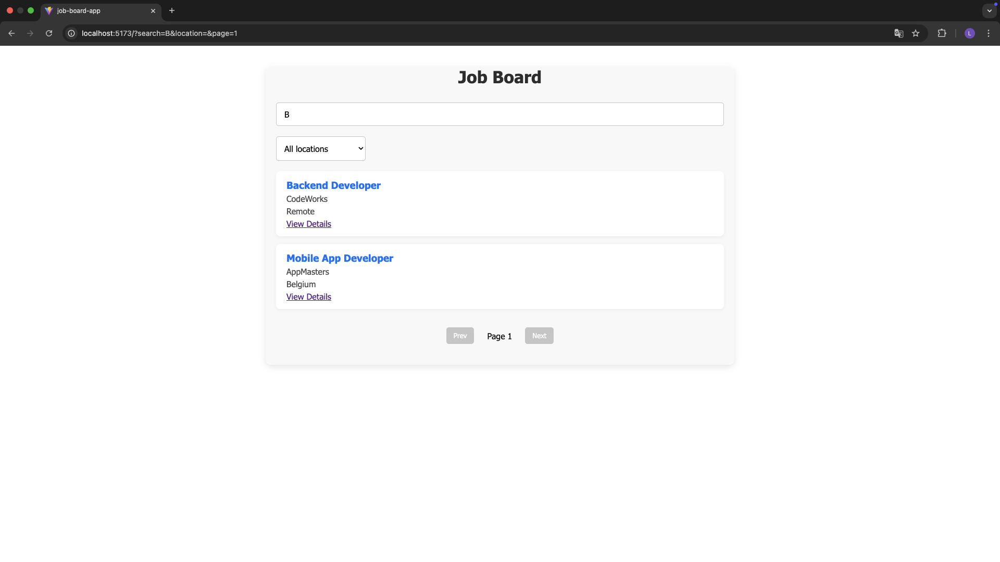
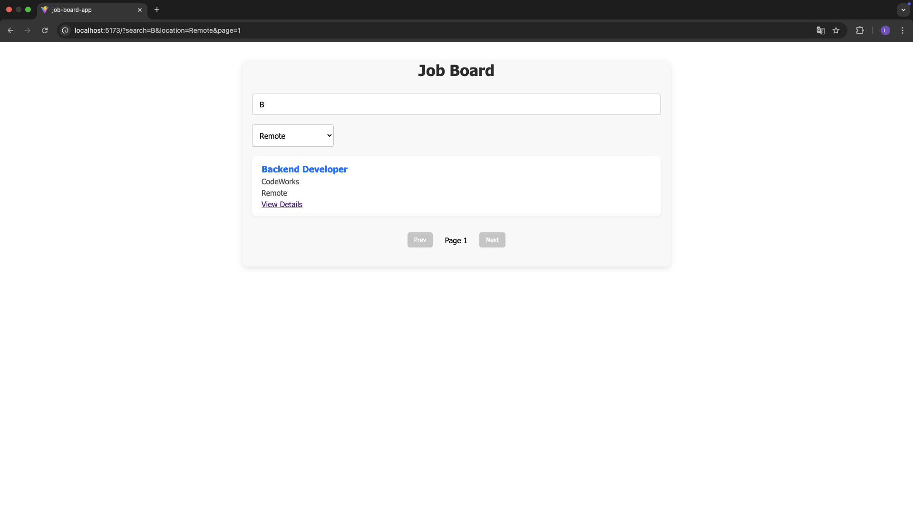
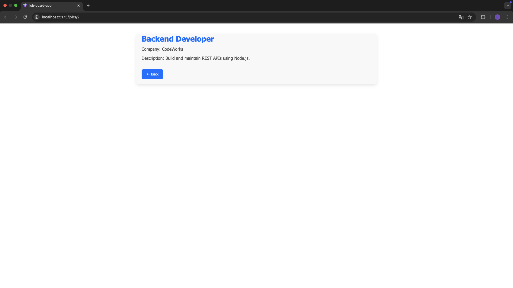
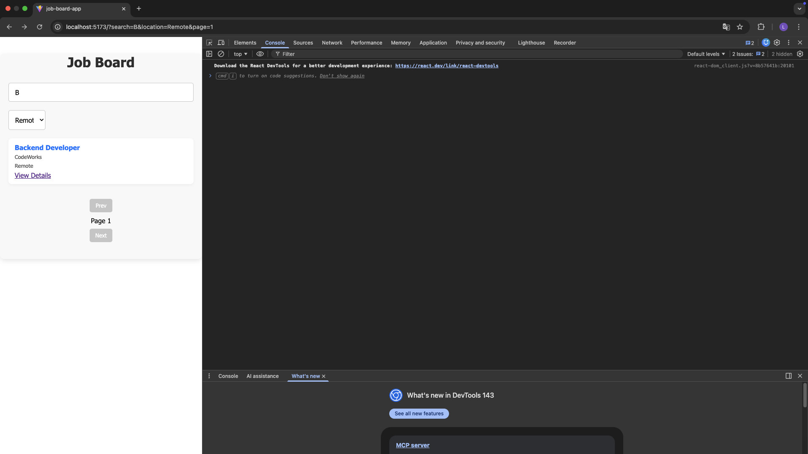
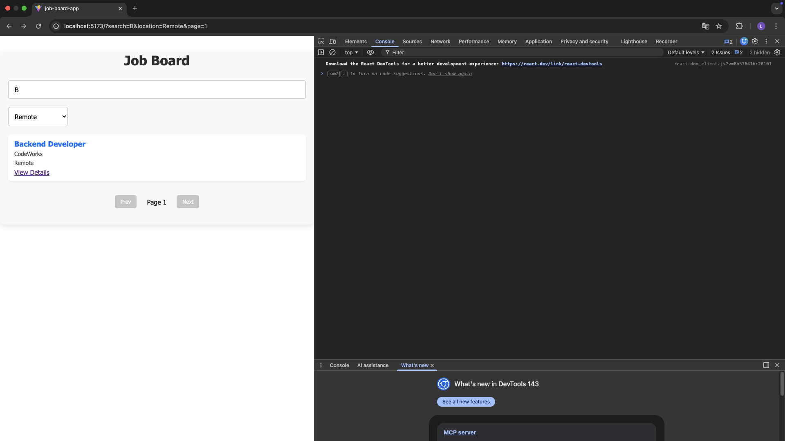

# Job Board App

A React job board built to show real-world frontend patterns: routing, pagination, debounced search, URL-synced state, and responsive layouts — without leaning on a UI library to do the hard parts.


---

## Live Demo

**[job-board-app-ivory.vercel.app](https://job-board-app-ivory.vercel.app)**

> ⏳ Data comes from a mock API (JSON Server) hosted on Render's free tier. If it's been idle, the first request can take 15–20 seconds to wake up.

**A note on the "API":** this isn't a real backend — it's [JSON Server](https://github.com/typicode/json-server) serving a static `db.json` file, which is a standard way to mock a REST API for frontend work. It behaves like a real API (routing, filtering, pagination all hit real HTTP requests) but there's no actual database or write persistence behind it. I'm calling that out explicitly so it's clear what this project is testing — frontend architecture, not backend design.

---

## Features

**Core**
- Job listing fetched from the mock API, with loading and error states
- Job details page with dynamic routing (`/jobs/:id`)
- Client-side pagination (5 jobs per page, adjusts automatically when filters reduce results)
- Search by job title or company, filter by location

**Frontend architecture**
- Debounced search input (500ms) to avoid firing a request on every keystroke
- Search, filter, and pagination state synced to the URL — refresh, share the link, or hit browser back/forward, and the state holds
- Route-based lazy loading for the Job Details page, with a custom Suspense fallback, to keep the initial bundle smaller

---

## Tech Stack

- React (Hooks)
- React Router
- JSON Server (mock API)
- CSS (responsive, no UI framework)
- Vite

---

## Getting Started

```bash
# Clone the repository
git clone https://github.com/TheDutchman68/job-board-app
cd job-board-app

# Install dependencies
npm install
```

Create a `.env` file in the project root:
```
VITE_API_URL=https://job-board-api-1yuc.onrender.com
```

```bash
npm run dev
```
The app will be available at `http://localhost:5173`.

### Running the mock API locally (optional)
If you'd rather not depend on the hosted Render instance while developing, you can run the mock API locally using the included `db.json`:
```bash
npx json-server --watch db.json --port 3001
```
Then point `VITE_API_URL` in your `.env` to `http://localhost:3001` instead.

---

## Why I built it this way

The URL-synced state was the part I went back and reworked the most. My first version kept search/filter/pagination in local component state, which worked fine until I refreshed the page or hit the back button and lost everything — at that point it stopped feeling like a real app. Moving that state into the URL query params fixed it, but it meant rethinking how the components read and update state: instead of `useState`, the URL itself became the source of truth, and the components just sync to it.

---

## Future Improvements

- Authentication (login / protected routes)
- Server-side pagination
- Saved jobs / favorites
- Skeleton loaders
- A real backend instead of the JSON Server mock

---

## Screenshots

### Job List


### Search & Filter



### Job Details


### Mobile / Tablet



---

## Author

**Natanael Dobie** — Frontend Developer (React/TypeScript)

[](https://www.linkedin.com/in/natanael-dobie-776059249)
[](https://portfolio-react-nu-taupe.vercel.app)

## License

MIT
